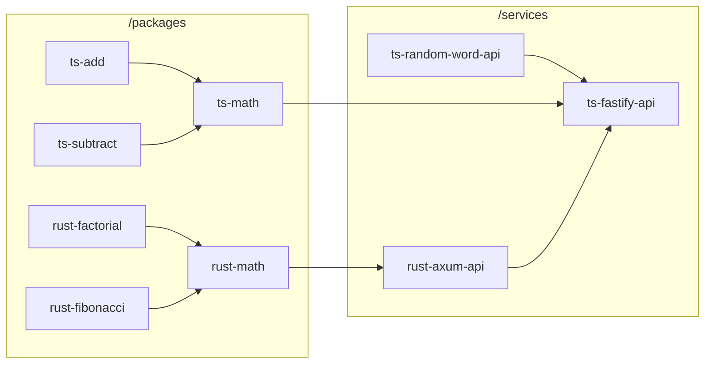

# ts-rust-monorepo

Monorepo template for TypeScript + Rust packages and services.

## Features

- [x] Containerized local development using Docker
- [x] [pnpm](https://pnpm.io/) for managing JS dependencies
- [x] [Cargo Workspace](https://doc.rust-lang.org/cargo/reference/workspaces.html) for Rust projects
- [ ] Auto-generated OpenAPI (swagger) docs and shared type libs for TypeScript and Rust services
- [x] Version and release management using [changesets](https://github.com/changesets/changesets)

## NPM Registry

Everything in this repo is listed under my own GitHub registry @s2lsoftener. You should replace that with your own in all the files.

To login to the registry in your CLI, use

```sh
pnpm login --scope=@NAMESPACE --auth-type=legacy --registry=https://npm.pkg.github.com
```

## Quick Start

Initialize .env files:

```sh
./dev/init-env.sh
```

To enable local development:

```sh
pnpm install
```

To start the services locally:

```sh
docker compose up -d --build
docker compose logs -f
```

Services will build and start according to this project graph.


