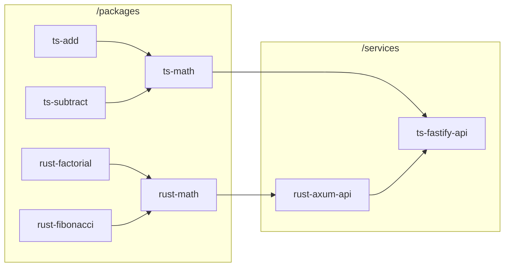

# ts-rust-monorepo

Monorepo template for TypeScript + Rust packages and services.

## Features
- [ ] Containerized local development using Docker [Compose Watch](https://docs.docker.com/compose/file-watch/)
- [ ] [pnpm](https://pnpm.io/) for managing JS dependencies
- [ ] [Cargo Workspace](https://doc.rust-lang.org/cargo/reference/workspaces.html) for Rust projects
- [ ] [Nx](https://nx.dev/) for running and caching tasks under a cross-language dependency graph.
- [ ] Auto-generated OpenAPI (swagger) docs and shared type libs for TypeScript and Rust services


## Quick Start

```sh
docker compose up -d 
docker compose logs -f
```

This will build and start services according to this project graph.


